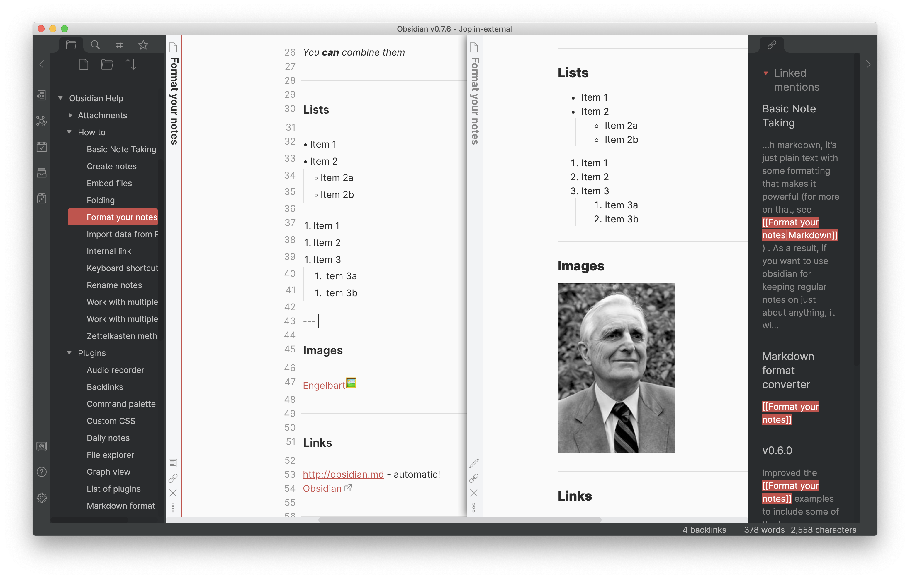

# Red Graphite for Obsidian

## Fork Notes

2020-01-11:

- v0.9.18 compliant.
- Removed Andy Matuschak mode since [deathau/sliding-panes-obsidian](https://github.com/deathau/sliding-panes-obsidian) works better.

***

This is a mesh-up (mainly for myself) of Red Graphite for Obsidian, [elliotboyd/obsidian-traffic-lights](https://github.com/elliotboyd/obsidian-traffic-lights), [deathau/psuedo-wysiwyg-obsidian-theme](https://github.com/deathau/psuedo-wysiwyg-obsidian-theme) and various other tweaks from [Meta Post - Common CSS Hacks - Share & showcase - Obsidian Forum](https://forum.obsidian.md/t/meta-post-common-css-hacks/1978). All credits are written in the code also.

## Manual Install

1. Download obsidian.css to your Obsidian vault folder.
1. In Obsidian, click the **Settings** icon
1. Go to **Appearance** and ensure that your theme is set to `Moonstone (light)`
1. Go to **Plugins**, and enable **Custom CSS**
